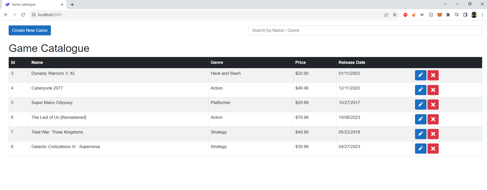
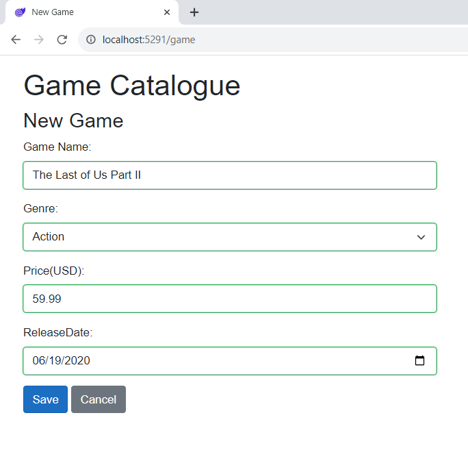

# GameCatalogue
 Local .NET and Blazor SPA application to simulate a video game catalogue. 
 
 + ASP.NET
 + Data Binding 
 + Server and Client Data Validation
 + Dependency Injection
 + Bootstrap for CSS
 + CRUD 
 + Docker
 + SQL
 + Secret Manager (for passwords)
 + Entity Framework Core (cross platform ORM mapping)
 + Automatic DB migration


 ## Starting SQL server Docker container
 ```powershell
 # the PASSWORD has to be At least 8 characters including uppercase, lowercase letters, base-10 digits and/or non-alphanumeric symbols!!
docker run -e "ACCEPT_EULA=Y" -e "MSSQL_SA_PASSWORD=HereIsALongPass*!" -p 1433:1433 -d -v sqlvolume:/var/opt/mssql --rm --name mssql mcr.microsoft.com/mssql/server:2022-latest
 ```

 ## Setting the connection string via Secret Manager
  ```powershell
  # instead of being in appsettings.json:
dotnet user-secrets set "ConnectionStrings:GameCatalogueContext" "Server=localhost; Database=GameStore; User Id=sa ; Password=HereIsALongPass*!; TrustServerCertificate=True;"
  ```
 ## Screenshots
  
  
  